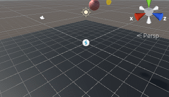
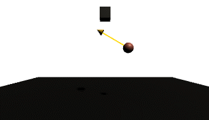

# LaForce
Sample project showing how to use handles to display a rigidbody velocity

Learn how to display the resulting velocity using a custom editor

Learn how to fake the same arrow at runtime

